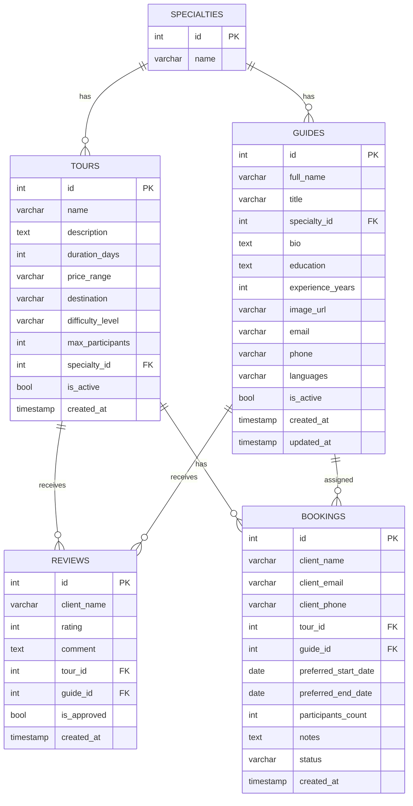

## ER-диаграмма (Tours Agency)

```mermaid
erDiagram
  SPECIALTIES ||--o{ GUIDES : has
  SPECIALTIES ||--o{ TOURS : has
  TOURS ||--o{ REVIEWS : receives
  GUIDES ||--o{ REVIEWS : receives
  TOURS ||--o{ BOOKINGS : has
  GUIDES ||--o{ BOOKINGS : assigned

  SPECIALTIES {
    int id PK
    varchar name
  }
  GUIDES {
    int id PK
    varchar full_name
    varchar title
    int specialty_id FK
    text bio
    text education
    int experience_years
    varchar image_url
    varchar email
    varchar phone
    varchar languages
    bool is_active
    timestamp created_at
    timestamp updated_at
  }
  TOURS {
    int id PK
    varchar name
    text description
    int duration_days
    varchar price_range
    varchar destination
    varchar difficulty_level
    int max_participants
    int specialty_id FK
    bool is_active
    timestamp created_at
  }
  REVIEWS {
    int id PK
    varchar client_name
    int rating
    text comment
    int tour_id FK
    int guide_id FK
    bool is_approved
    timestamp created_at
  }
  BOOKINGS {
    int id PK
    varchar client_name
    varchar client_email
    varchar client_phone
    int tour_id FK
    int guide_id FK
    date preferred_start_date
    date preferred_end_date
    int participants_count
    text notes
    varchar status
    timestamp created_at
  }
```

Нормализация: справочник SPECIALTIES исключает дублирование, остальные атрибуты зависят только от PK в своих таблицах — соблюдается 3НФ.

