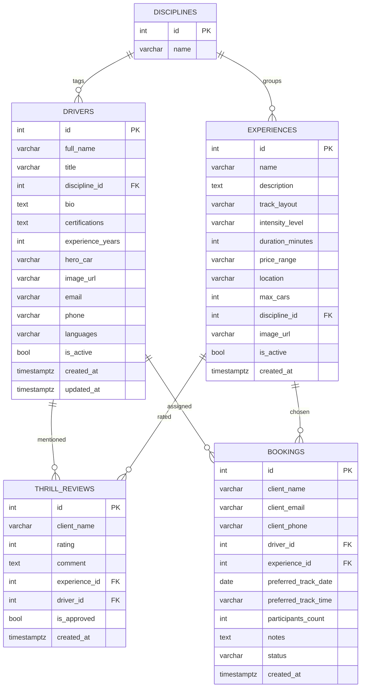

## ER-диаграмма (SuperCar Experience)

<<<<<<< HEAD
Нормализация: справочник SPECIALTIES исключает дублирование, остальные атрибуты зависят только от PK в своих таблицах — соблюдается 3НФ.

=======
Нормализация: справочник DISCIPLINES устраняет дубли направлений, остальные таблицы содержат только атрибуты, зависящие от своих PK → соблюдается 3НФ.
>>>>>>> origin/main
